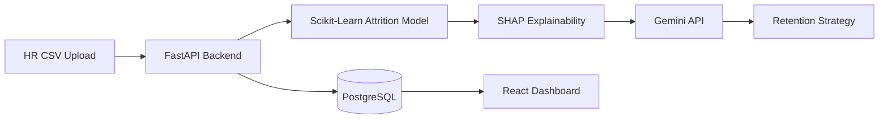

# Nexus HR: AI-Powered Predictive Analytics Platform


A decoupled, full-stack predictive analytics pipeline designed to identify employee flight risk, extract marginal feature importance using Explainable AI (SHAP), and generate actionable retention strategies using Generative AI.

**Live Demo:** [hr-predictive-analytics.vercel.app](https://hr-predictive-analytics.vercel.app/)

---

## 🚀 Enterprise Features

* **Predictive Attrition Modeling:** Evaluated Logistic Regression, Random Forest, and XGBoost. Deployed an optimized Logistic Regression model achieving 59% recall and 0.36 F1-score after extensive data preprocessing and class imbalance mitigation.
* **Explainable AI (SHAP):** Unboxes the black-box model by extracting the top 3 marginal drivers contributing to an individual's specific flight risk probability.
* **Generative AI Insights:** Pipes SHAP drivers and employee metrics into the Gemini 2.5 Flash LLM to auto-generate personalized, 3-step retention rescue plans.
* **Batch Processing Engine:** Ingests and processes enterprise CSV datasets (1,400+ records) in seconds, automatically seeding the PostgreSQL database and running inference.
* **MLOps Telemetry:** Live dashboard tracking inference volume, API latency (ms), and rolling prediction averages to monitor real-time model health and distribution drift.

---

##  📊 Model Design Decision

The model's decision threshold was tuned to favor recall (59%) over precision. In an attrition
context, a false negative (missing an employee who is about to leave) is materially more
costly than a false positive (flagging a stable employee for review) — the former is a lost
retention opportunity, the latter is a low-cost manager check-in. This tradeoff, not raw
F1-score, is the correct lens for evaluating this model's fitness for its actual use case.

## 🛠️ Technical Architecture

### 1. Model Training & Pipeline (Offline)
* **Stack:** Python, Pandas, Scikit-Learn, Jupyter
* **Pipeline:** Feature engineering, categorical encoding (OHE), continuous variable scaling (StandardScaler), SMOTE for class imbalance.
* **Artifacts:** `attrition_model.pkl`, `scaler.pkl`, `shap_explainer.pkl`, `model_features.pkl`.

### 2. Backend API (Production)
* **Framework:** FastAPI
* **Database:** PostgreSQL (Neon) with SQLAlchemy ORM
* **Authentication:** Bcrypt password hashing
* **Deployment:** Render (Serverless)

### 3. Frontend Client
* **Framework:** React.js (Vite)
* **State Management:** React Hooks
* **Styling:** CSS / Tailwind
* **Deployment:** Vercel

---


## 🏗️ System Architecture


---


## 💻 Local Setup Instructions

### Prerequisites
* Python 3.10+
* Node.js 18+
* PostgreSQL Database URL
* Google Gemini API Key

### 1. Clone the Repository
```bash
git clone https://github.com/samruddhi-t12/hr-predictive-analytics.git
cd hr-predictive-analytics
cd backend
```

## Create and activate virtual environment
```bash
python -m venv venv
source venv/bin/activate  # On Windows use `venv\Scripts\activate`
```

## Install dependencies
```bash
pip install -r requirements.txt
```

## Environment Variables: Create a .env file in the backend folder
```bash
echo "DATABASE_URL=your_neon_postgres_url" > .env
echo "GEMINI_API_KEY=your_gemini_api_key" >> .env
```

## Run the FastAPI server
```bash
uvicorn main:app --reload
```
The backend will now be running on http://localhost:8000

### 3. Frontend Setup
Open a new terminal window:
cd frontend

## Install dependencies
```bash
npm install
```

## Environment Variables: Create a .env file in the frontend folder
```bash
echo "VITE_API_URL=http://localhost:8000" > .env
```

## Run the development server
```bash
npm run dev
```
The frontend will now be running on http://localhost:5173

## 🔒 Security & CORS
The production backend is strictly configured to only accept requests from the deployed Vercel frontend domain via explicit CORS middleware configurations. Authentication payloads are secured using industry-standard bcrypt hashing before database insertion.

